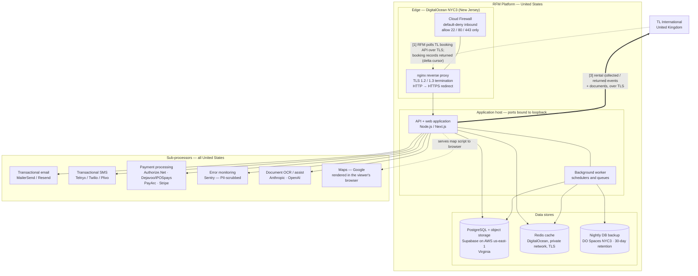

# RFM — Architecture & Data-Flow Diagram (for TL International)

**Date:** 2026-08-23
**Purpose:** the network / data-flow and architecture diagram requested in Section 4 of the TL
International information request. It shows the production systems (DDQ 3.2), the sub-processors
(DDQ 3.4), and the inbound / outbound data journey (DDQ Section 2). **All infrastructure and
sub-processing is located in the mainland United States; nothing is hosted in Puerto Rico.**

---

## Diagram

*(This block renders as a diagram in GitHub and any Mermaid-aware viewer. A rendered image can be
exported for inclusion in the response pack.)*

---

## Narrative (keyed to the diagram)

**[1] Inbound — reservation collection.** The platform **polls** TL's booking API on a schedule over
TLS, using a delta cursor, and receives booking records. Records land in a dedicated staging table
and are reviewed before becoming live reservations; unmatched records are held for human review.
Polling (rather than a webhook push) keeps retry/buffering/failure handling on our side and lets us
determine and evidence the field set transferred, which supports data minimisation.

**[2] Processing in the US.** All inbound traffic terminates TLS at the nginx reverse proxy behind a
default-deny cloud firewall; the application and API ports are bound to loopback and are never
reachable except through that proxy. The application and worker store data in the Supabase-managed
PostgreSQL and object storage (AWS `us-east-1`, Virginia), use a private-network Redis cache
(DigitalOcean), and write nightly encrypted-in-transit backups to DO Spaces (New Jersey, 30-day
retention). Sub-processors are engaged only to deliver the specific function shown against each.

**[3] Outbound — rental data returned to the UK.** On vehicle collection and on vehicle return, the
platform emits a structured event to TL over TLS, followed by the associated rental documents (a
manifest step declares each document with type, size and SHA-256 hash; TL selects which to receive).
Every outbound transmission is recorded in a durable audit table with a content hash, timestamps,
TL's acknowledgement reference, delivery status and retry history.

## Data residency

| Component | Provider | Location |
|---|---|---|
| Application, API, reverse proxy, Redis, backups | DigitalOcean | NYC3 — Clifton, **New Jersey, US** |
| Primary database + document/photo object storage | Supabase (on AWS) | `us-east-1` — **Northern Virginia, US** |
| All sub-processors (§3.4) | Various | **United States** |
| Puerto Rico | — | **No hosting, storage, backup or replica** |

No data is stored, processed, backed up or replicated outside the United States. The Puerto Rico
relationship is corporate (a franchisee that uses the platform), not a hosting location.
